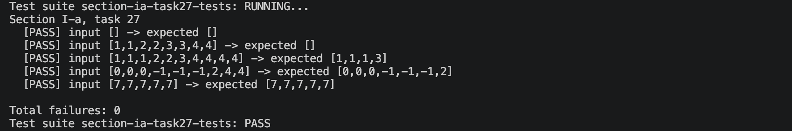

# Звіт до задачі I-a, варіант 27

## Умова задачі

Залишити у списку елементи, що мають непарну кількість входжень у список.

## Код програми

```haskell
module SectionIA.Task27Solution
  ( keepOddFrequencyElements
  ) where

import Data.List (group, sort)

oddFrequencyValues :: [Int] -> [Int]
oddFrequencyValues xs =
  [value | values@(value:_) <- group (sort xs), odd (length values)]

keepOddFrequencyElements :: [Int] -> [Int]
keepOddFrequencyElements xs = filter (`elem` oddValues) xs
  where
    oddValues = oddFrequencyValues xs
```

## Умови тестів

1. Порожній список перевіряє граничний випадок без елементів: результат також має бути порожнім.
2. Список, у якому кожне значення трапляється парну кількість разів, перевіряє повне відкидання всіх елементів.
3. Змішаний список з парними й непарними кількостями входжень перевіряє, що залишаються лише всі копії значень з непарною частотою.
4. Список з нулем, від'ємними та додатними числами перевіряє, що алгоритм працює не тільки для додатних значень.
5. Список з одним значенням, яке повторюється непарну кількість разів, перевіряє, що зберігаються всі його копії.

## Екранний знімок з результатами виконання тестів


