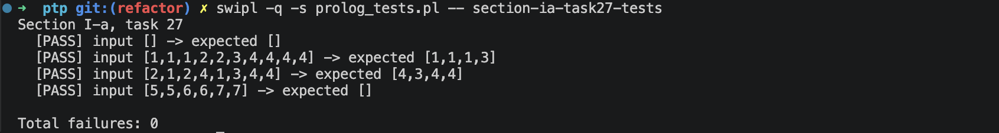

# Звіт до задачі I-a, варіант 27

## Умова задачі

Залишити у списку елементи, що мають непарну кількість входжень у список.

## Код програми

```prolog
:- module(section_ia_task27, [keep_odd_frequency_elements/2]).

keep_odd_frequency_elements(List, Result) :-
    keep_odd_frequency_elements(List, List, Result).

keep_odd_frequency_elements(_, [], []).
keep_odd_frequency_elements(FullList, [Head|Tail], [Head|ResultTail]) :-
    count_occurrences(FullList, Head, Count),
    Count mod 2 =:= 1,
    keep_odd_frequency_elements(FullList, Tail, ResultTail).
keep_odd_frequency_elements(FullList, [Head|Tail], Result) :-
    count_occurrences(FullList, Head, Count),
    Count mod 2 =:= 0,
    keep_odd_frequency_elements(FullList, Tail, Result).

count_occurrences([], _, 0).
count_occurrences([Value|Tail], Value, Count1) :-
    count_occurrences(Tail, Value, Count),
    Count1 is Count + 1.
count_occurrences([Head|Tail], Value, Count) :-
    Head \= Value,
    count_occurrences(Tail, Value, Count).
```

## Умови тестів

1. Порожній список перевіряє граничний випадок без елементів: результат також має бути порожнім.
2. Змішаний список з парними й непарними кількостями входжень перевіряє, що залишаються тільки елементи зі значеннями непарної частоти.
3. Список, у якому потрібні елементи розташовані не підряд, перевіряє збереження початкового порядку відібраних елементів.
4. Список, де всі значення трапляються парну кількість разів, перевіряє повне відкидання елементів.

## Екранний знімок з результатами виконання тестів


