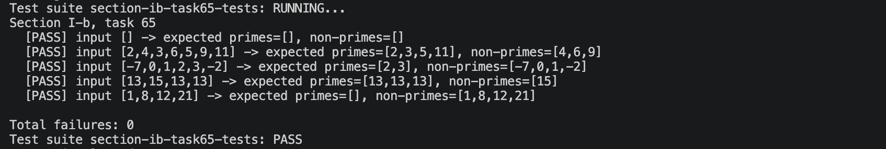

# Звіт до задачі I-b, варіант 65

## Умова задачі

Розбити список на два списки відповідно до умови - "бути чи не бути простим числом".

## Код програми

```haskell
module SectionIB.Task65Solution
  ( splitPrimeNonPrime
  ) where

import Data.List (partition)

isPrime :: Int -> Bool
isPrime n
  | n <= 1 = False
  | n == 2 = True
  | even n = False
  | otherwise = hasNoOddDivisorFrom 3
  where
    hasNoOddDivisorFrom :: Int -> Bool
    hasNoOddDivisorFrom divisor
      | divisor * divisor > n = True
      | n `mod` divisor == 0 = False
      | otherwise = hasNoOddDivisorFrom (divisor + 2)

splitPrimeNonPrime :: [Int] -> ([Int], [Int])
splitPrimeNonPrime = partition isPrime
```

## Умови тестів

1. Порожній список перевіряє граничний випадок: обидва результуючі списки мають бути порожніми.
2. Змішаний список простих і складених чисел перевіряє правильний розподіл елементів зі збереженням їхнього порядку в кожній групі.
3. Список з від'ємними числами, нулем та одиницею перевіряє, що всі числа менші за 2 не вважаються простими.
4. Список з повтореннями простого числа перевіряє, що кожне входження простого числа зберігається в списку простих.
5. Список лише з непростих чисел перевіряє випадок, коли список простих має бути порожнім.

## Екранний знімок з результатами виконання тестів


