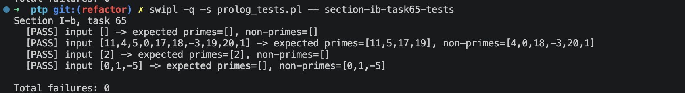

# Звіт до задачі I-b, варіант 65

## Умова задачі

Розбити список на два списки відповідно до умови - «бути чи не бути простим числом».

## Код програми

```prolog
:- module(section_ib_task65, [split_prime_nonprime/3]).

split_prime_nonprime([], [], []).
split_prime_nonprime([Head|Tail], [Head|Primes], NonPrimes) :-
    is_prime(Head),
    split_prime_nonprime(Tail, Primes, NonPrimes).
split_prime_nonprime([Head|Tail], Primes, [Head|NonPrimes]) :-
    \+ is_prime(Head),
    split_prime_nonprime(Tail, Primes, NonPrimes).

is_prime(2).
is_prime(Number) :-
    integer(Number),
    Number > 2,
    Number mod 2 =\= 0,
    has_no_odd_divisor_from(Number, 3).

has_no_odd_divisor_from(Number, Divisor) :-
    Divisor * Divisor > Number.
has_no_odd_divisor_from(Number, Divisor) :-
    Number mod Divisor =\= 0,
    NextDivisor is Divisor + 2,
    has_no_odd_divisor_from(Number, NextDivisor).
```

## Умови тестів

1. Порожній список перевіряє граничний випадок: списки простих і непростих чисел мають бути порожніми.
2. Змішаний список з простими, складеними, нулем, одиницею та від'ємним числом перевіряє повну класифікацію різних типів вхідних значень.
3. Список з одним простим числом перевіряє мінімальний непорожній випадок, де елемент має потрапити до списку простих.
4. Список лише з числами, які не є простими, перевіряє, що числа менші за 2 не потрапляють до списку простих.

## Екранний знімок з результатами виконання тестів


