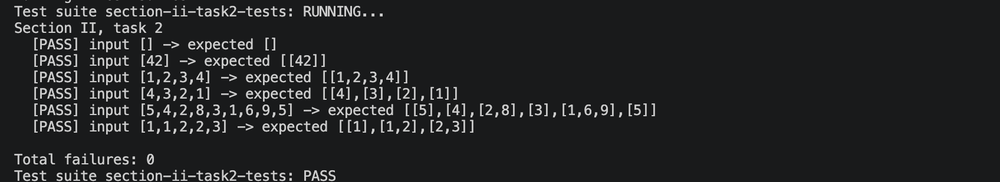

# Звіт до задачі II, варіант 2

## Умова задачі

Розбити список на впорядковані за зростанням підсписки (із збереженням порядку слідування елементів).

## Код програми

```haskell
module SectionII.Task2Solution
  ( splitIncreasingRuns
  ) where

splitIncreasingRuns :: [Int] -> [[Int]]
splitIncreasingRuns = foldr splitStep []

splitStep :: Int -> [[Int]] -> [[Int]]
splitStep x [] = [[x]]
splitStep x (run@(y:_):runs)
  | x < y = (x : run) : runs
  | otherwise = [x] : run : runs
```

## Умови тестів

1. Порожній список перевіряє граничний випадок без підсписків.
2. Список з одного елемента перевіряє, що одиничний елемент утворює один впорядкований підсписок.
3. Повністю зростаючий список перевіряє, що вся послідовність залишається одним підсписком.
4. Повністю спадний список перевіряє, що кожен елемент починає окремий підсписок.
5. Приклад із різними зростаючими ділянками перевіряє основний сценарій розбиття на кілька підсписків зі збереженням порядку.
6. Список з рівними сусідніми значеннями перевіряє, що рівність не вважається строгим зростанням і починає новий підсписок.

## Екранний знімок з результатами виконання тестів


