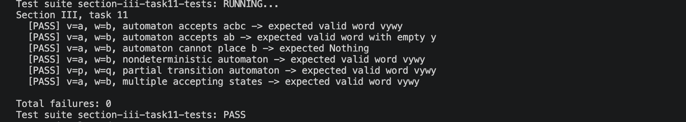

# Звіт до задачі III, варіант 11

## Умова задачі

Для заданих слів `v` і `w` виявити, чи допускає скінчений автомат хоча б одне слово, що може бути подане у вигляді `vywy` для деякого слова `y`. При ствердній відповіді навести приклад відповідного слова `vywy`.

## Код програми

```haskell
module SectionIII.Task11Solution
  ( State
  , Symbol
  , Word
  , Transition(..)
  , Automaton(..)
  , Problem(..)
  , delta
  , run
  , accepts
  , solveY
  , solve
  ) where

import Data.List (foldl', nub)
import Data.Foldable (asum)
import Data.Sequence (Seq, ViewL(..), (|>))
import qualified Data.Sequence as Seq
import qualified Data.Set as Set
import Prelude hiding (Word)

type State = Int
type Symbol = Char
type Word = [Symbol]

data Transition = Transition State Symbol State
  deriving (Eq, Show)

data Automaton = Automaton
  { qs :: [State]
  , sigma :: [Symbol]
  , q0 :: State
  , fs :: [State]
  , edges :: [Transition]
  }
  deriving (Eq, Show)

data Problem = Problem
  { fa :: Automaton
  , v :: Word
  , w :: Word
  }
  deriving (Eq, Show)

type Pair = (State, State)
type Node = (State, State, Word)

delta :: Automaton -> State -> Symbol -> [State]
delta a q x =
  nub
    [ q'
    | Transition p y q' <- edges a
    , p == q
    , y == x
    ]

run :: Automaton -> [State] -> Word -> [State]
run a q0s = foldl' step (nub q0s)
  where
    step :: [State] -> Symbol -> [State]
    step ps x =
      nub
        [ q
        | p <- ps
        , q <- delta a p x
        ]

accepts :: Automaton -> Word -> Bool
accepts a xs =
  any (`elem` fs a) (run a [q0 a] xs)

solve :: Problem -> Maybe Word
solve p =
  build p <$> solveY p

solveY :: Problem -> Maybe Word
solveY p =
  asum
    [ syncY p q1 q3
    | q1 <- run a [q0 a] (v p)
    , q3 <- nub (qs a)
    ]
  where
    a = fa p

syncY :: Problem -> State -> State -> Maybe Word
syncY p q1 q3 =
  bfs Set.empty (Seq.singleton (q1, q3, []))
  where
    a = fa p

    bfs :: Set.Set Pair -> Seq Node -> Maybe Word
    bfs seen queue =
      case Seq.viewl queue of
        EmptyL ->
          Nothing
        (q2, q4, y) :< rest
          | goal q2 q4 ->
              Just y
          | Set.member (q2, q4) seen ->
              bfs seen rest
          | otherwise ->
              bfs seen' queue'
          where
            seen' = Set.insert (q2, q4) seen
            queue' = foldl' (|>) rest (next q2 q4 y)

    goal :: State -> State -> Bool
    goal q2 q4 =
      q3 `elem` run a [q2] (w p)
        && q4 `elem` fs a

    next :: State -> State -> Word -> [Node]
    next q2 q4 y =
      [ (q2', q4', y ++ [x])
      | x <- nub (sigma a)
      , q2' <- delta a q2 x
      , q4' <- delta a q4 x
      ]

build :: Problem -> Word -> Word
build p y =
  v p ++ y ++ w p ++ y
```

## Опис алгоритму

Нехай задано скінченний автомат `M = (Q, Σ, δ, q0, F)` та слова `v` і `w`. Потрібно встановити, чи існує слово `y ∈ Σ*`, для якого `vywy` допускається автоматом, і в разі існування побудувати один такий приклад.

Алгоритм не перебирає слова `y` безпосередньо, оскільки множина `Σ*` нескінченна. Замість цього задача зводиться до пошуку у скінченному просторі пар станів автомата.

Після читання `v` автомат може перебувати в деякому стані `q1`. Перше входження слова `y` переводить його в стан `q2`; після читання `w` він має перейти в деякий стан `q3`; після другого входження того самого слова `y` автомат має опинитися в заключному стані. Стан `q3` наперед невідомий, тому перебирається серед усіх станів `Q`.

Оскільки автомат може бути недетермінованим, множина можливих станів після `v` обчислюється функцією `run`. Для кожного такого `q1` і кожного `q3 ∈ Q` виконується пошук у ширину за конфігураціями `(q2, q4, y)`.

Пара `(q2, q4)` відповідає одночасному читанню одного й того самого префікса слова `y`: перша компонента описує перше входження `y` після `v`, друга - друге входження `y` після `vyw`. Продовження відбувається одним і тим самим символом в обох компонентах, тому обидва входження `y` залишаються однаковими.

Якщо для поточної конфігурації зі стану `q2` після слова `w` можна потрапити у вибраний стан `q3`, а `q4` є заключним, то знайдене `y` є розв'язком. У цьому випадку алгоритм повертає `v ++ y ++ w ++ y`.

## Обґрунтування завершуваності

Для фіксованих `q1` і `q3` алгоритм працює тільки з парами станів `(q2, q4) ∈ Q × Q`. Оскільки множина станів `Q` скінченна, кількість таких пар не перевищує `|Q|^2`.

Множина `seen` зберігає вже оброблені пари. Якщо пара `(q2, q4)` зустрічається повторно, її можна пропустити, бо подальші переходи визначаються лише поточними станами, а не словом, яким ці стани були досягнуті.

Пошук у ширину розглядає конфігурації за зростанням довжини побудованого слова. Тому, якщо для вибраних `q1` і `q3` існує відповідне `y`, воно буде знайдене після скінченної кількості кроків.

Якщо відповідного слова для цієї пари немає, черга BFS спорожніє після обробки всіх досяжних пар. Після скінченного перебору всіх можливих `q1` і `q3` алгоритм або повертає знайдене слово, або завершується з результатом `Nothing`.

## Опис ітеративного процесу

### Ініціалізація (нульовий крок)

На початку обчислюється множина станів, досяжних після читання `v` з початкового стану `q0`: `run a [q0 a] (v p)`.

Для кожного такого `q1` і кожного `q3 ∈ Q` створюється початкова конфігурація `(q1, q3, "")`, де порожній рядок означає ще не побудоване слово `y`.

На нульовому кроці черга BFS містить цю конфігурацію, а множина `seen` є порожньою.

### Загальний крок ітерації

На кожному кроці з черги вилучається конфігурація `(q2, q4, y)`, де `y` є поточним префіксом шуканого слова. Стан `q2` відповідає першому входженню цього префікса, а стан `q4` - другому.

Якщо пара `(q2, q4)` уже була оброблена, алгоритм переходить до наступного елемента черги. Інакше ця пара додається до множини `seen`.

Далі для кожного символу `x ∈ Σ` одночасно виконуються переходи `q2 --x--> q2'` і `q4 --x--> q4'`. Для кожної можливої комбінації переходів у чергу додається конфігурація `(q2', q4', y ++ [x])`.

Отже, обидва входження слова `y` продовжуються одним і тим самим символом.

### Умова припинення ітерації

Ітерація завершується успішно для конфігурації `(q2, q4, y)`, якщо після читання `w` зі стану `q2` автомат може потрапити у вибраний стан `q3`, а `q4` є заключним станом.

У програмі ці умови мають вигляд: `q3` належить `run a [q2] (w p)` і `q4` належить `fs a`. Якщо вони виконані, алгоритм повертає `v ++ y ++ w ++ y`.

Якщо черга BFS стала порожньою, це означає, що для поточних станів `q1` і `q3` відповідного слова `y` не знайдено. Тоді алгоритм переходить до наступної пари `q1`, `q3`. Якщо всі такі пари вичерпано, повертається `Nothing`.

### Оцінка максимальної кількості кроків

Для одного фіксованого вибору `q1` і `q3` простір пошуку містить не більше `|Q|^2` різних пар `(q2, q4)`. Завдяки множині `seen` кожна така пара обробляється не більше одного разу.

Кількість можливих значень `q1` не перевищує `|Q|`, і кількість значень `q3` також не перевищує `|Q|`.

Отже, максимальна кількість запусків BFS не перевищує `|Q|^2`, а максимальна кількість оброблених пар станів у всіх запусках разом не перевищує `|Q|^2 * |Q|^2 = |Q|^4`.

На кожному кроці розглядаються символи алфавіту `Σ` та відповідні переходи автомата. Тому загальна кількість операцій переходу скінченна й оцінюється зверху величиною, пропорційною `|Σ| * |Q|^4` з урахуванням способу зберігання переходів. Просторова складність одного запуску BFS становить `O(|Q|^2)`.

## Умови тестів

1. Автомат, який допускає слово з непорожнім `y`, перевіряє основний позитивний сценарій пошуку слова вигляду `vywy`.
2. Автомат, який допускає слово при `y = ε`, перевіряє, що алгоритм коректно обробляє порожнє слово `y` і не вимагає додаткових символів.
3. Автомат, у якому фіксоване слово `w` неможливо розмістити між двома однаковими частинами `y`, перевіряє негативний сценарій і повернення `Nothing`.
4. Автомат з недетермінованими переходами перевіряє, що алгоритм розглядає всі можливі переходи, а не лише один шлях.
5. Автомат з частково відсутніми переходами перевіряє, що пошук не ламається на неповній функції переходів і знаходить коректний шлях, якщо він існує.
6. Автомат з кількома заключними станами перевіряє, що слово приймається при досягненні будь-якого з допустимих фінальних станів.

## Екранний знімок з результатами виконання тестів


