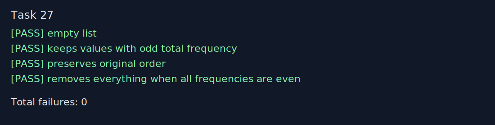

# Звіт до задачі I-a, варіант 27

- Номер модуля: не вказано в наданих матеріалах
- Номер розділу: I-a
- Номер варіанту: 27
- Умова задачі: Залишити у списку елементи, що мають непарну кількість входжень у список.

## Код програми

```prolog
:- module(section_ia_task27, [keep_odd_frequency_elements/2]).

keep_odd_frequency_elements(List, Result) :-
    keep_odd_frequency_elements(List, List, Result).

keep_odd_frequency_elements(_, [], []).
keep_odd_frequency_elements(FullList, [Head|Tail], [Head|ResultTail]) :-
    count_occurrences(FullList, Head, Count),
    Count mod 2 =:= 1,
    keep_odd_frequency_elements(FullList, Tail, ResultTail).
keep_odd_frequency_elements(FullList, [Head|Tail], Result) :-
    count_occurrences(FullList, Head, Count),
    Count mod 2 =:= 0,
    keep_odd_frequency_elements(FullList, Tail, Result).

count_occurrences([], _, 0).
count_occurrences([Value|Tail], Value, Count1) :-
    count_occurrences(Tail, Value, Count),
    Count1 is Count + 1.
count_occurrences([Head|Tail], Value, Count) :-
    Head \= Value,
    count_occurrences(Tail, Value, Count).
```

## Умови тестів

1. `keep_odd_frequency_elements([], Result).` Очікувано: `Result = []`.
2. `keep_odd_frequency_elements([1,1,1,2,2,3,4,4,4,4], Result).` Очікувано: `Result = [1,1,1,3]`.
3. `keep_odd_frequency_elements([2,1,2,4,1,3,4,4], Result).` Очікувано: `Result = [4,3,4,4]`.
4. `keep_odd_frequency_elements([5,5,6,6,7,7], Result).` Очікувано: `Result = []`.

## Екранний знімок з результатами виконання тестів


