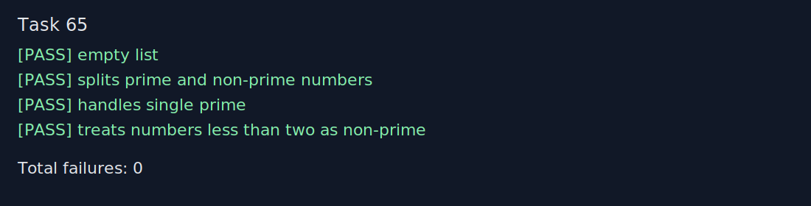

# Звіт до задачі I-b, варіант 65

- Номер модуля: не вказано в наданих матеріалах
- Номер розділу: I-b
- Номер варіанту: 65
- Умова задачі: Розбити список на два списки відповідно до умови - «бути чи не бути простим числом».

## Код програми

```prolog
:- module(section_ib_task65, [split_prime_nonprime/3]).

split_prime_nonprime([], [], []).
split_prime_nonprime([Head|Tail], [Head|Primes], NonPrimes) :-
    is_prime(Head),
    split_prime_nonprime(Tail, Primes, NonPrimes).
split_prime_nonprime([Head|Tail], Primes, [Head|NonPrimes]) :-
    \+ is_prime(Head),
    split_prime_nonprime(Tail, Primes, NonPrimes).

is_prime(2).
is_prime(Number) :-
    integer(Number),
    Number > 2,
    Number mod 2 =\= 0,
    has_no_odd_divisor_from(Number, 3).

has_no_odd_divisor_from(Number, Divisor) :-
    Divisor * Divisor > Number.
has_no_odd_divisor_from(Number, Divisor) :-
    Number mod Divisor =\= 0,
    NextDivisor is Divisor + 2,
    has_no_odd_divisor_from(Number, NextDivisor).
```

## Умови тестів

1. `split_prime_nonprime([], Primes, NonPrimes).` Очікувано: `Primes = []`, `NonPrimes = []`.
2. `split_prime_nonprime([11,4,5,0,17,18,-3,19,20,1], Primes, NonPrimes).` Очікувано: `Primes = [11,5,17,19]`, `NonPrimes = [4,0,18,-3,20,1]`.
3. `split_prime_nonprime([2], Primes, NonPrimes).` Очікувано: `Primes = [2]`, `NonPrimes = []`.
4. `split_prime_nonprime([0,1,-5], Primes, NonPrimes).` Очікувано: `Primes = []`, `NonPrimes = [0,1,-5]`.

## Екранний знімок з результатами виконання тестів


