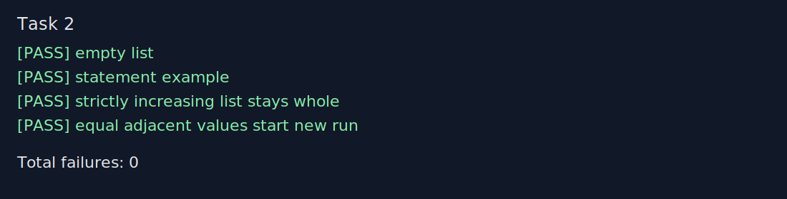

# Звіт до задачі II, варіант 2

- Номер модуля: не вказано в наданих матеріалах
- Номер розділу: II
- Номер варіанту: 2
- Умова задачі: Розбити список на впорядковані за зростанням підсписки (із збереженням порядку слідування елементів).

## Код програми

```prolog
:- module(section_ii_task2, [split_increasing_runs/2]).

split_increasing_runs([], []).
split_increasing_runs([Head|Tail], [Run|Runs]) :-
    take_increasing_run(Tail, Head, [Head], Run, Rest),
    split_increasing_runs(Rest, Runs).

take_increasing_run([], _, ReversedRun, Run, []) :-
    reverse_list(ReversedRun, Run).
take_increasing_run([Head|Tail], Previous, ReversedRun, Run, [Head|Tail]) :-
    Head =< Previous,
    reverse_list(ReversedRun, Run).
take_increasing_run([Head|Tail], _, ReversedRun, Run, Rest) :-
    take_increasing_run(Tail, Head, [Head|ReversedRun], Run, Rest).

reverse_list(List, Reversed) :-
    reverse_list(List, [], Reversed).

reverse_list([], Accumulator, Accumulator).
reverse_list([Head|Tail], Accumulator, Reversed) :-
    reverse_list(Tail, [Head|Accumulator], Reversed).
```

## Умови тестів

1. `split_increasing_runs([], Runs).` Очікувано: `Runs = []`.
2. `split_increasing_runs([5,4,2,8,3,1,6,9,5], Runs).` Очікувано: `Runs = [[5],[4],[2,8],[3],[1,6,9],[5]]`.
3. `split_increasing_runs([1,2,3,4], Runs).` Очікувано: `Runs = [[1,2,3,4]]`.
4. `split_increasing_runs([3,3,4,4,5], Runs).` Очікувано: `Runs = [[3],[3,4],[4,5]]`.

## Екранний знімок з результатами виконання тестів


